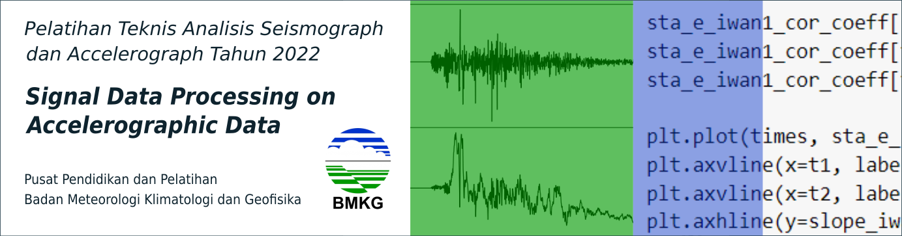

<!--  -->
# Kajian Ground Motion Pendukung Pokja InaTEWS

**Oleh:**  
Dr.rer.nat. Wiwit Suryanto, M.Si  

**Waktu:**

Jumat, 28 Juli 2023 | 10.30 – 11.45 WIB

**Tempat:**
Hotel Santika Teras Kota, Banten

**Agenda:**
- 10.30 - 10.45 Signal Processing Ground Motion for Geophysics analysis
- 10.45 - 11.45 Noise Analysis for Seismology and Exploration

## Data:
1. [Rekaman Akselerogram CWB.TCU129 Gempa Chi-Chi 1999](./data)

## Jadwal
| **Topik** |
|:-----------|
| **SESI 0: [*Preparasi Data*](https://colab.research.google.com/drive/1kutb6hNb6Z8R9Vg-6HPieDCvwvLPzRjX?usp=sharing)** |
| 1. Melakukan integrasi Google Drive dengan Google Colab |
| 2. Mengecek hasil integrasi Google Drive dengan Google Colab |
||
| **SESI 1: [Pengenalan Obspy dan Pengolahan Sinyal Sederhana](https://colab.research.google.com/drive/1kcoiGy76ng7Ih89Yh-GtOJMMZk-uOJud?usp=sharing)** |
| 1. Membaca Data Seismik |
| 2. Menggabungkan Data Seismik Multitrace |
| 3. Melakukan Pengolahan Sinyal Sederhana |
||
| **SESI 2: [Simulasi Gerakan Tanah](https://colab.research.google.com/drive/1BrYXD3plRC-yJKxAMstpxtn8-4z0G_t-?usp=sharing)** |
| 1. Membaca Data Seismik |
| 2. Manajemen Metadata Stasiun |
| 3. Melakukan Koreksi Instrumen |
| 4. Simulasi Gerakan Tanah |
||
| **SESI 3: [Koreksi Baseline](https://colab.research.google.com/drive/14eGsrfZoHV2pwogly_-HzXRRJBtCnWB3?usp=sharing)** |
| 1. Membaca Data Seismik |
| 2. Melakukan Integrasi untuk Mendapatkan Kecepatan dan *displacement* |
| 3. Koreksi *Baseline* dengan *Pre-event* |
| 4. Koreksi *Baseline* dengan *fitting* Data *Event* |
| 5. Aplikasi Filter Akausal |
| 6. Aplikasi Filter Kausal |
| 7. Contoh implementasi Metode Iwan (1985) Opsi 1 |
||
| **SESI 4: [Ambient Noise Tomography](https://colab.research.google.com/drive/1UZAEt9oTp0dGJqfxFqIuth_uBhgL_T9F?usp=sharing)** |
| 1. Menyiapkan data seismik |
| 2. Menyiapkan metadata stasiun |
| 3. Menampilkan ketersediaan data |
| 4. Menyiapkan *job* untuk korelasi silang |
| 5. Membuat fungsi-fungsi *preprocessing* |
| 6. Melakukan korelasi silang |
| 7. Menampilkan kurva dispersi |
||

## Referensi
Bensen, GD & Ritzwoller, Michael & Barmin, MP & Levshin, Anatoli & Lin, Feifan & Moschetti, Morgan & Shapiro, Nikolai & Yang, Yingjie. (2007). Processing seismic ambient noise data to obtain reliable broad-band surface wave dispersion measurements. Geophysical Journal International. 169. 1239-1260. 10.1111/j.1365-246X.2007.03374.x. 
Boore, D. M., 1999, Effect of Baseline Corrections on Response Spectra for Two Recordings of the 1999 Chi-Chi, Taiwan, Earthquake: U. S. Geological Survey Open-File Report 99-545, 37 pp., https://pubs.usgs.gov/of/1999/0545/.  
Center for Engineering and Strong Motion Data (https://www.strongmotioncenter.org/)  
Chao, WA., Wu, YM. & Zhao, L. An automatic scheme for baseline correction of strong-motion records in coseismic deformation determination. J Seismol 14, 495–504 (2010). https://doi.org/10.1007/s10950-009-9178-7    
Iwan, W. D., M. A. Moser, and C.-Y. Peng (1985). Some observations on strong-motion
earthquake measurement using a digital accelerograph, Bull. Seism. Soc. Am. 75,
1225–1246  
Wu, Y.-M., & Wu, C.-F. (2007). Approximate recovery of coseismic deformation from Taiwan strong-motion records. Journal of Seismology, 11(2), 159–170. doi:10.1007/s10950-006-9043-x 
